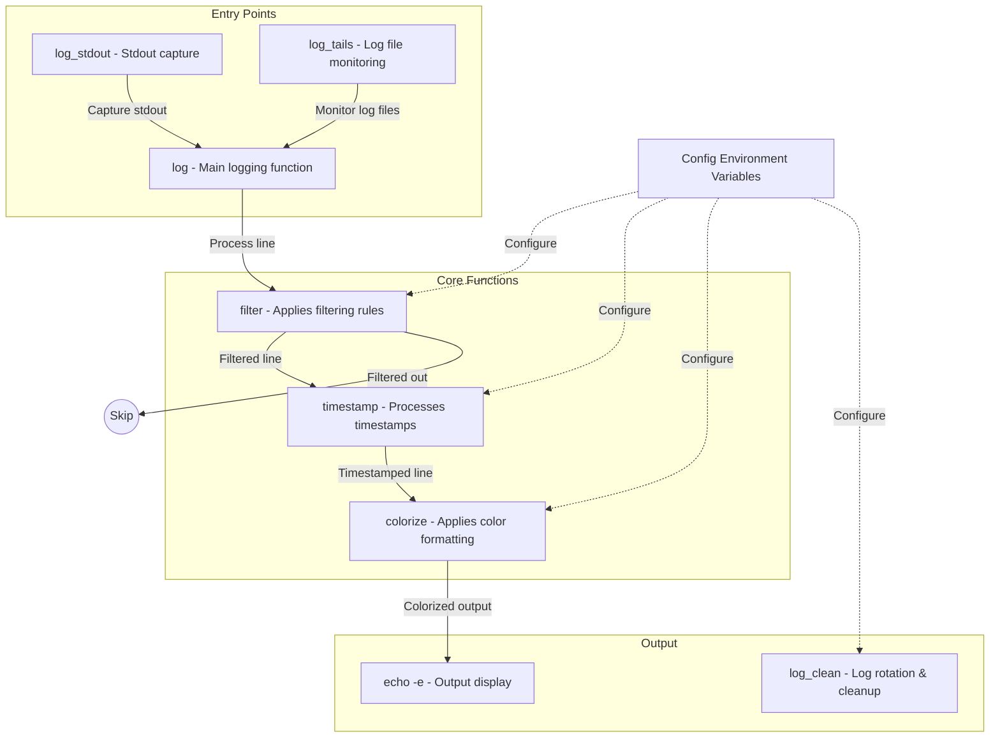

# Modular Logging System

A simple, configurable bash logging system with filtering, timestamp processing, and colorized output.

## Features

- **Simple API**: Just call `log "your message"` to log
- **Modular Design**: Three core functions - filter, timestamp, colorize
- **Environment Configuration**: All settings in one config file
- **Log File Monitoring**: Automatically tail log files
- **Log Rotation**: Compress and clean logs
- **Configurable Filtering**: Skip unwanted log messages
- **Timestamp Processing**: Extract and normalize timestamps
- **Colorized Output**: Highlight important information
- **Minimal Dependencies**: Uses standard bash tools

## Usage

### Basic Logging

```bash
## Log a message
log "System starting"

## Log with custom source name
log "Database connection established" "db_handler"

## Capture stdout from a command
some_command | log_stdout "command_output"

## Monitor log files
log_tails
```

### Configuration

Edit the `logging_config.sh` file to customize behavior:

```bash
# Filtering options
# Comma-separated list of strings to skip if they appear in log lines
export LOG_FILTER_SKIP="Debug,Trace,Processing shader,Unloading stale assets"
  
# Comma-separated list of strings to ONLY include if they appear (leave empty to include all non-skipped)
export LOG_FILTER_INCLUDE=""

# Color formatting rules
# Available colors: RED, GREEN, YELLOW, BLUE, MAGENTA, CYAN, WHITE
# Prefix with BOLD_ for bold colors (e.g., BOLD_RED)
export LOG_COLOR_LINE_RULES="(ERROR):BOLD_RED,(WARNING):YELLOW"
export LOG_COLOR_WORD_RULES="(database):CYAN,(success):GREEN"

# Timestamp formatting
# Format for timestamps (standard, iso8601, compact)
export LOG_TIMESTAMP_FORMAT="standard"

# Log formatting
# Format template (use %DATE%, %TIME%, %FILE%, %MSG% as placeholders)
export LOG_FORMAT_TEMPLATE="%DATE% %TIME% [%FILE%]: %MSG%"

# Log rotation settings
# Number of days before compressing logs
export LOG_ROTATION_DAYS_TO_GZIP=2
# Number of days before deleting compressed logs
export LOG_ROTATION_DAYS_TO_DELETE=4
```

## Core Functions

### filter()

Determines if a log line should be processed based on its content.

- Skips empty lines
- Skips lines containing strings in the `LOG_FILTER_SKIP` config
- Only includes lines containing strings in the `LOG_FILTER_INCLUDE` config (if set)

### timestamp()

Processes timestamps in log lines.

- Extracts existing timestamps if present
- Normalizes timestamps to a consistent format
- Generates new timestamps when none are found

### colorize()

Applies color formatting to log lines.

- Applies whole-line coloring based on `LOG_COLOR_LINE_RULES`
- Applies word-specific coloring based on `LOG_COLOR_WORD_RULES`
- Supports multiple colors and bold formatting

## Configuration Reference

### Filtering Options

- `LOG_FILTER_SKIP` - Comma-separated list of strings to skip
- `LOG_FILTER_INCLUDE` - Comma-separated list of strings to include (only)

### Color Rules

- `LOG_COLOR_LINE_RULES` - Format: `"regex1:COLOR1,regex2:COLOR2"`
- `LOG_COLOR_WORD_RULES` - Format: `"regex1:COLOR1,regex2:COLOR2"`
- Available colors: RED, GREEN, YELLOW, BLUE, MAGENTA, CYAN, WHITE
- Prefix with BOLD_ for bold colors (e.g., BOLD_RED)

### Timestamp Options

- `LOG_TIMESTAMP_FORMAT` - Format for timestamps (standard, iso8601, compact)

### Log Format

- `LOG_FORMAT_TEMPLATE` - Format template with placeholders: %DATE%, %TIME%, %FILE%, %MSG%
- `LOG_FORMAT_CLEANUP` - Comma-separated sed patterns for cleanup

### Log Rotation

- `LOG_ROTATION_DAYS_TO_GZIP` - Number of days before compressing logs
- `LOG_ROTATION_DAYS_TO_DELETE` - Number of days before deleting compressed logs

## Flow Diagram



## Project Structure

- `logging_config.sh` - Environment variable configuration 
- `logging_functions` - Core logging functions
- `up.sh` - Application startup script that uses the logging system
- `update_functions` - Server and mod update functions

## Extending in Derivative Containers

The logging system is designed to be easily extended in derivative containers through a simple configuration file mechanism.

### Using Application Config

1. Create a file named `logging_app_config.sh` in the same directory as the logging functions
2. Use one of two methods to modify the configuration:
   - To extend/append to existing settings: prefix with `+`
   - To completely override settings: omit the prefix

### Example Application Config

```bash
#!/bin/bash
# Application-specific logging configuration

# Extend existing filters (uses + prefix)
export LOG_FILTER_SKIP="+AppDebug,AppTrace"

# Override color rules (no prefix)
export LOG_COLOR_LINE_RULES="(AppError):BOLD_RED,(AppWarning):YELLOW"

# Extend word highlighting
export LOG_COLOR_WORD_RULES="+($USER_ID):BOLD_CYAN,(session):MAGENTA"
```

### Implementation in Dockerfile

```dockerfile
FROM your-base-image

# Copy your app-specific config
COPY ./logging_app_config.sh /scripts/

# Rest of your container configuration
...
```

This approach allows derivative containers to either extend or replace the base configuration without modifying the core logging functions.
